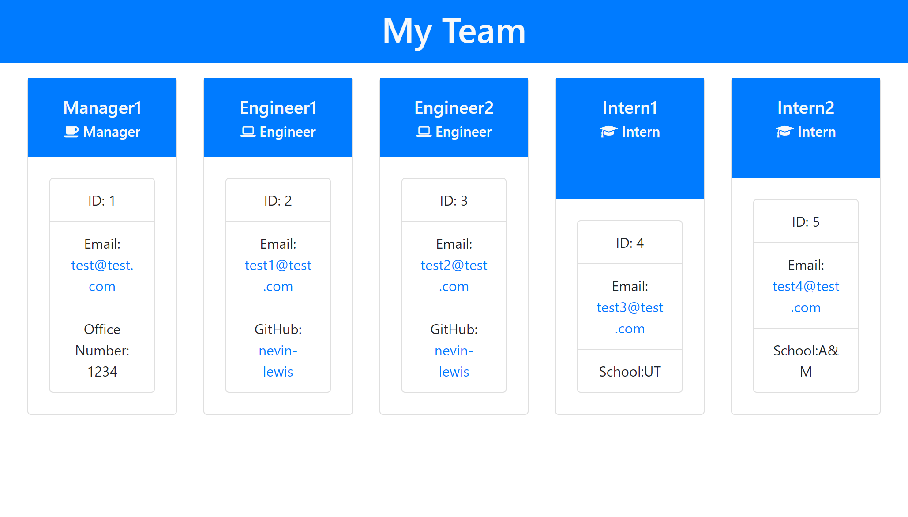

# Team Profile Generator [](https://opensource.org/licenses/MIT)

    
    
## Description
    
This is the repo I generated for my team profile generator program. After copying the repo, “npm i” will install the necessary dependencies. After that, opening a terminal and running node index.js will initiate the Team Profile generator. Input all the relative data for the Manager and select an option to complete your page or add other members. Contiue adding memebers until the team is complete. Once all members are added select the finish building my team option. Input a name for the index file. After that is done a .html should be generated that has been filled with your entire team.

## Table of Contents
* [Installation](#installation)
* [Usage](#usage)
* [License](#license)
* [Contributing](#contributing)
* [Test](#test)
* [Questions](#questions)
* [Photo](#photo)
* [Video](#usage video)


## Installation
To install necessary depnedencies, run the follow commands:

```
npm i
```

## Usage

After the necessary dependencies are downloaded run node index.js in the terminal to initiate the app. Answer all questions and then add more teams or select finish building my team. After that is completed a .html file will be generated and placed in the Dist folder.

## License

<details>

<summary> MIT License </summary>

MIT License

    Copyright (c) 2022 Nevin Lewis
    
    Permission is hereby granted, free of charge, to any person obtaining a copy of this software and associated documentation files (the "Software"), to deal in the Software without restriction, including without limitation the rights to use, copy, modify, merge, publish, distribute, sublicense, and/or sell copies of the Software, and to permit persons to whom the Software is furnished to do so, subject to the following conditions:
    
    The above copyright notice and this permission notice shall be included in all copies or substantial portions of the Software.
    
    THE SOFTWARE IS PROVIDED "AS IS", WITHOUT WARRANTY OF ANY KIND, EXPRESS OR IMPLIED, INCLUDING BUT NOT LIMITED TO THE WARRANTIES OF MERCHANTABILITY, FITNESS FOR A PARTICULAR PURPOSE AND NONINFRINGEMENT. IN NO EVENT SHALL THE AUTHORS OR COPYRIGHT HOLDERS BE LIABLE FOR ANY CLAIM, DAMAGES OR OTHER LIABILITY, WHETHER IN AN ACTION OF CONTRACT, TORT OR OTHERWISE, ARISING FROM, OUT OF OR IN CONNECTION WITH THE SOFTWARE OR THE USE OR OTHER DEALINGS IN THE SOFTWARE.

</details>

## Contributing
N/A

## Test
To run test, run the following command:

```
jest employee
jest engineer
jest intern 
jest manager	
```

## Questions
If you have any quetsions about the repo, open an issue or contact me directly at github.com/nevin-lewis

## Photo


## Usage Video
[Untitled_ Nov 25 2022 8_25 AM.webm](https://user-images.githubusercontent.com/64855834/204093747-2b6878ba-01a4-4a8c-bbed-720487ff0384.webm)

